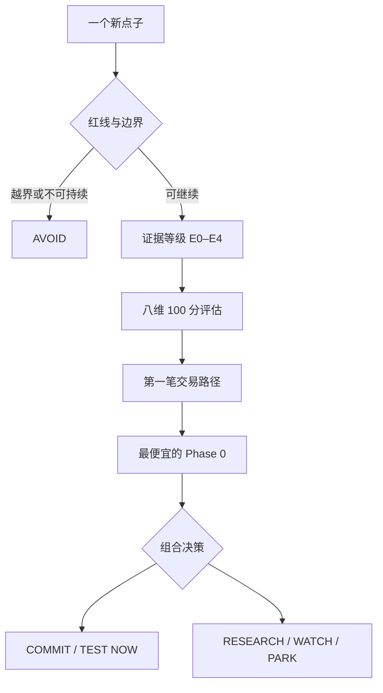

<div align="center">

# 🧭 Evaluate Indie Opportunity

**别让 AI 陪你把每个点子都做出来。先判断什么值得做。**

一个面向 OpenClaw / Agent Skills 的「独立产品投资委员会」：  
用证据、首笔交易、Phase 0 和停止规则，评估副业、AI 产品、开源变现、小游戏与睡后收入机会。

[](https://docs.openclaw.ai/tools/skills)
[](./SKILL.md)
[](./SKILL.md)
[](./LICENSE)
[](https://github.com/lornezhang66/evaluate-indie-opportunity/stargazers)

[快速安装](#-一分钟安装) · [查看方法](#-它如何判断) · [运行示例](./examples/quick-demo.md) · [直接使用](#-你可以这样问)

</div>

---

## 为什么需要它

AI 把开发成本降下来了，也制造了一个新问题：

> **每个点子看起来都能做，每个热门仓库都能包装成 SaaS，每个案例都像能赚到钱。**

很多副业失败，不是因为没做出来，而是因为太早做出来：

- 看见 Star，就把技术热度当成付费需求；
- 看见别人赚钱，就忽略渠道、时机与幸存者偏差；
- 用户只说“挺有意思”，自己已经开始设计账号、计费和后台；
- 还没找到第一个买家，就在讨论平台化和长期 ARR；
- 同时开三个项目，最后没有一个获得真实交易。

`evaluate-indie-opportunity` 不负责继续给你灵感。它负责在你兴奋的时候追问：

1. 谁会付钱？
2. 为什么现在付？
3. 你有什么真实证据？
4. 第一笔交易怎样发生？
5. 不做完整产品，怎么验证？
6. 什么情况下必须停止？

### 这个项目从哪里来

我是一名软件架构师，也在业余时间维护开源项目、尝试独立产品。AI 让“从想法到代码”越来越快，但我逐渐发现，真正稀缺的已经不是编码速度，而是：

> **在有限的业余时间里，判断什么值得做、什么只值得验证、什么应该坚决不做。**

这个 Skill 最初是给我自己的决策护栏：接住不断冒出的产品闪念，但不让每个闪念都变成一个新仓库。现在把它开源，希望它也能帮助同样想法很多、时间有限的开发者。

### 适合谁

- 总有新点子，但很难决定先做哪一个的开发者；
- 想给开源项目寻找可持续收入的维护者；
- 想利用 AI 做副业，但不愿被“搞钱案例”带着跑的人；
- 同时面对插件、SaaS、内容、小游戏和 ToB 机会的独立开发者；
- 需要在工作成果、个人知识产权与商业化之间守住边界的人。

## ⚡ 一分钟安装

安装到 OpenClaw 的所有本地 Agent：

```bash
openclaw skills install git:lornezhang66/evaluate-indie-opportunity@main --global
```

只安装到当前工作区：

```bash
openclaw skills install git:lornezhang66/evaluate-indie-opportunity@main
```

确认已经加载：

```bash
openclaw skills info evaluate-indie-opportunity
```

显式调用：

```text
/skill evaluate-indie-opportunity
```

Git 来源更新后，重新安装即可：

```bash
openclaw skills install git:lornezhang66/evaluate-indie-opportunity@main --global --force
```

## 👀 30 秒看懂输出

假设你问：

> 我发现一个很火的 AI 开源项目，想套一层 UI 做成订阅 SaaS，值得做吗？

它不会直接给你列功能，而会给出类似判断：

| 项目 | 判断 |
|---|---|
| 机会类别 | `CASH EXPERIMENT` 或 `STRATEGIC OPTION`，而不是直接立项 |
| 证据等级 | E0–E1：技术热度和 Star 不是付费证据 |
| 核心未知 | 谁在什么场景下，愿意为哪一个结果付钱 |
| 第一笔交易 | 先出售固定范围的安装、配置或代办结果 |
| Phase 0 | 找 10 位明确目标用户，演示同一个结果并提出真实报价 |
| 停止条件 | 无人愿意投入付款、押金或明确资源承诺，则不建设 SaaS |

完整的三类示例见 [`examples/quick-demo.md`](./examples/quick-demo.md)。

## 🧠 它如何判断



### 1. 先判断你在玩哪一种游戏

| 类别 | 目标 |
|---|---|
| `CASH EXPERIMENT` | 用最短时间完成第一笔真实小额交易 |
| `COMPOUNDING ASSET` | 积累产品、代码、内容、用户、数据、品牌或渠道 |
| `STRATEGIC OPTION` | 保留长期高上限方向的低成本学习权 |
| `CAPABILITY LAB` | 用于工作验证或能力训练，不急着商业化 |
| `AVOID` | 越界、灰色、不可持续，或收益结构不值得参与 |

### 2. 用证据等级限制“想象力得分”

| 等级 | 典型证据 | 分数上限 |
|---|---|---:|
| E0 | 灵感、榜单、热门案例、仓库介绍 | 49 |
| E1 | 竞品、公开抱怨、Issue、用户 workaround | 59 |
| E2 | 访谈、自然下载、重复使用、主动咨询 | 74 |
| E3 | 预付、押金、付费试点、真实付款 | 89 |
| E4 | 复购、留存、转介绍、稳定获客 | 100 |

即使想象空间再大，没有真实证据，也不能得到“立即重投入”的结论。

### 3. 八维 100 分评估

- 付费痛点与紧迫性；
- 证据强度；
- 创作者的结构化优势；
- 触达与分发能力；
- 第一笔交易清晰度；
- Phase 0 的速度与成本；
- 复利、留存与资产沉淀；
- 本职工作、知识产权和可持续边界。

详细评分表见 [`references/rubric.md`](./references/rubric.md)。

### 4. 强制产生一个可以证伪的 Phase 0

Phase 0 不是缩小版产品，而是**不依赖完整开发，也能推翻核心假设的实验**。

项目已经内置以下模式：

- SaaS、AI 工具和插件；
- 开源项目变现；
- ToB 产品和企业基础设施；
- 内容、课程和信息产品；
- 模板、数字商品、服务和咨询；
- 小游戏、联盟营销、工具站和电商。

参见 [`references/phase-zero-patterns.md`](./references/phase-zero-patterns.md)。

## 💬 你可以这样问

```text
我有一个产品闪念，请评估它有没有商业价值。先不要设计功能。
```

```text
这个 GitHub 项目很火，我能围绕它做哪些收入实验？哪些只是想象？
```

```text
比较这三个方向，只允许选一个正式主线和一个两周微实验。
```

```text
我想做小游戏赚第一笔互联网收入。请给出 Phase 0 和停止规则。
```

```text
这个想法来自我的工作，请先检查雇佣、知识产权和客户数据边界。
```

## 与普通“商业分析 Prompt”有什么不同

| 普通回答容易出现的问题 | 本 Skill 的约束 |
|---|---|
| 为了鼓励用户而抬高判断 | 明确要求诚实判断，不为鼓励加分 |
| 用市场故事代替用户证据 | 强制区分事实、推断、假设和未知 |
| 上来就设计完整产品 | 首先设计第一笔交易和 Phase 0 |
| 只有建议，没有退出机制 | 每次评估都必须给出停止条件 |
| 每个点子都值得继续 | 只能选择 `COMMIT / TEST / RESEARCH / WATCH / PARK / AVOID` |
| 忽略项目之间的资源竞争 | 默认一条正式主线，加一个限时微实验 |

## 📁 仓库结构

```text
.
├── SKILL.md                         # 核心工作流与输出协议
├── references/
│   ├── rubric.md                    # E0–E4 证据等级与八维评分
│   ├── phase-zero-patterns.md       # 不同商业模型的验证模式
│   └── source-policy.md             # 方法论来源权重与防误用规则
├── examples/
│   └── quick-demo.md                # 三类快速评估示例
└── LICENSE                          # MIT-0
```

项目没有运行时依赖，不读取密钥，也不执行外部脚本；它是一套供 Agent 调用的判断流程。

## 方法论来源

本项目独立综合了精益副业、一人企业、独立开发和多种收入模型中的方向性原则，并对“AI 搞钱案例”和热门开源项目保持证据审慎。

主要参考：

- [easychen/lean-side-bussiness](https://github.com/easychen/lean-side-bussiness)
- [easychen/opc-methodology](https://github.com/easychen/opc-methodology)
- [mezod/awesome-indie](https://github.com/mezod/awesome-indie)
- [garylab/MakeMoneyWithAI](https://github.com/garylab/MakeMoneyWithAI)
- [XiaomingX/ai-money-maker-handbook](https://github.com/XiaomingX/ai-money-maker-handbook)
- [yourincomehome/awesome-passive-income](https://github.com/yourincomehome/awesome-passive-income)

具体的来源权重、许可证提醒和防误用规则见 [`references/source-policy.md`](./references/source-policy.md)。

## 路线图

- [ ] 增加更多真实评估案例和复盘结果；
- [ ] 根据实际付费与停止案例校准评分；
- [ ] 增加英文版使用说明；
- [ ] 发布到 ClawHub，支持注册表安装与更新；
- [ ] 探索跨 Agent 的机会决策日志格式。

## 参与与反馈

欢迎通过 [Issues](https://github.com/lornezhang66/evaluate-indie-opportunity/issues) 提交：

- 一个被 Skill 成功否决的伪需求；
- 一个通过 Phase 0 获得真实付款的案例；
- 评分偏高、偏低或边界判断失真的反例；
- 新的收入模型和更便宜的验证方式。

如果它帮助你少做了一个错误项目，或者更快验证了一次真实交易，欢迎点一个 **Star**。  
这会帮助更多容易被新点子吸引的开发者发现它。⭐
